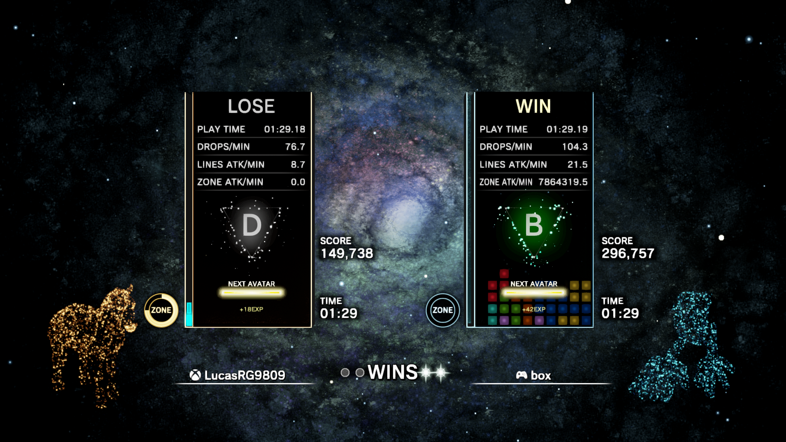
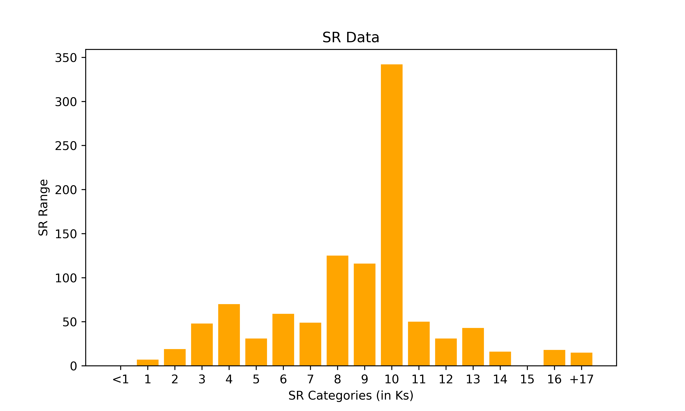
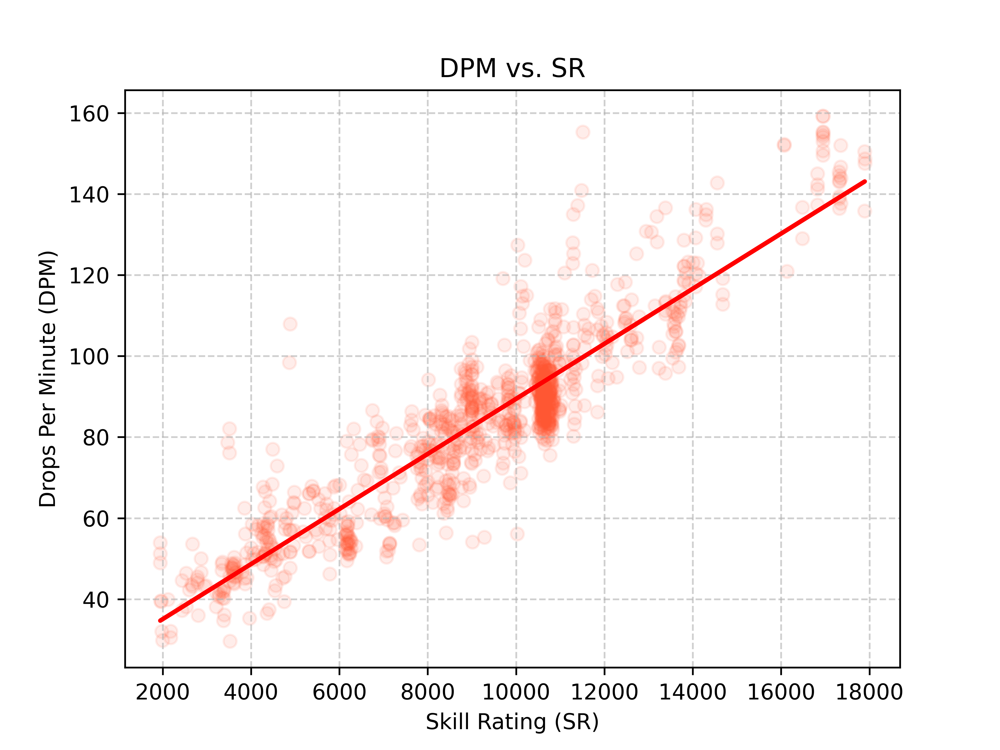
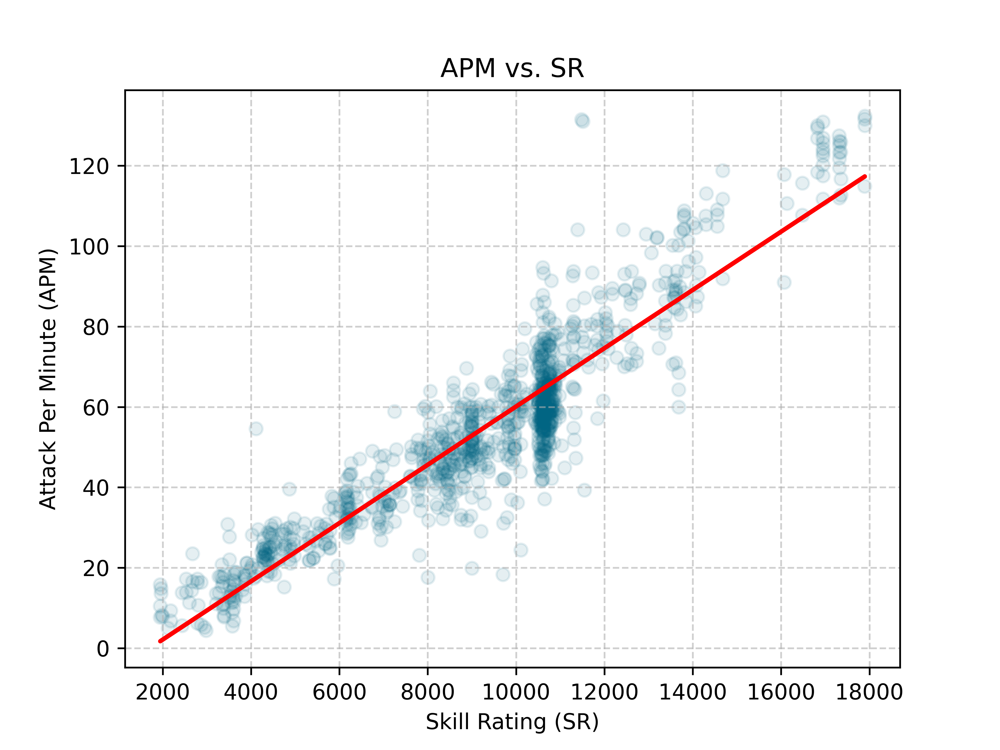
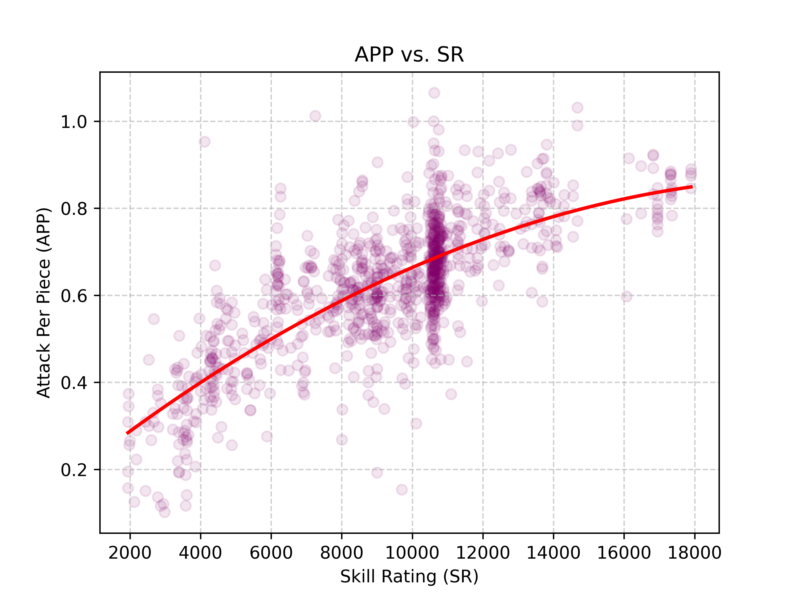
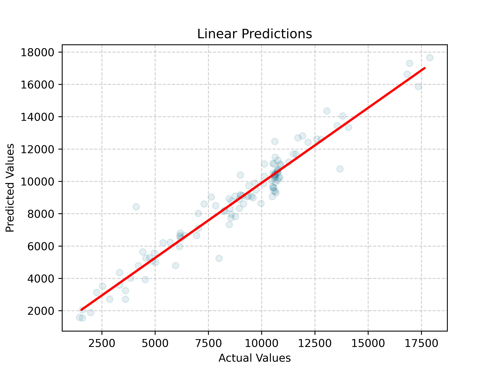
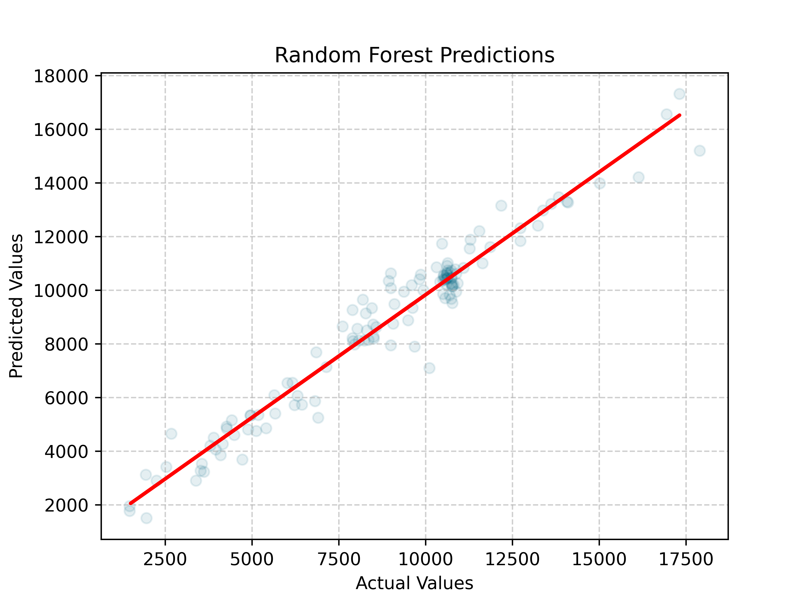
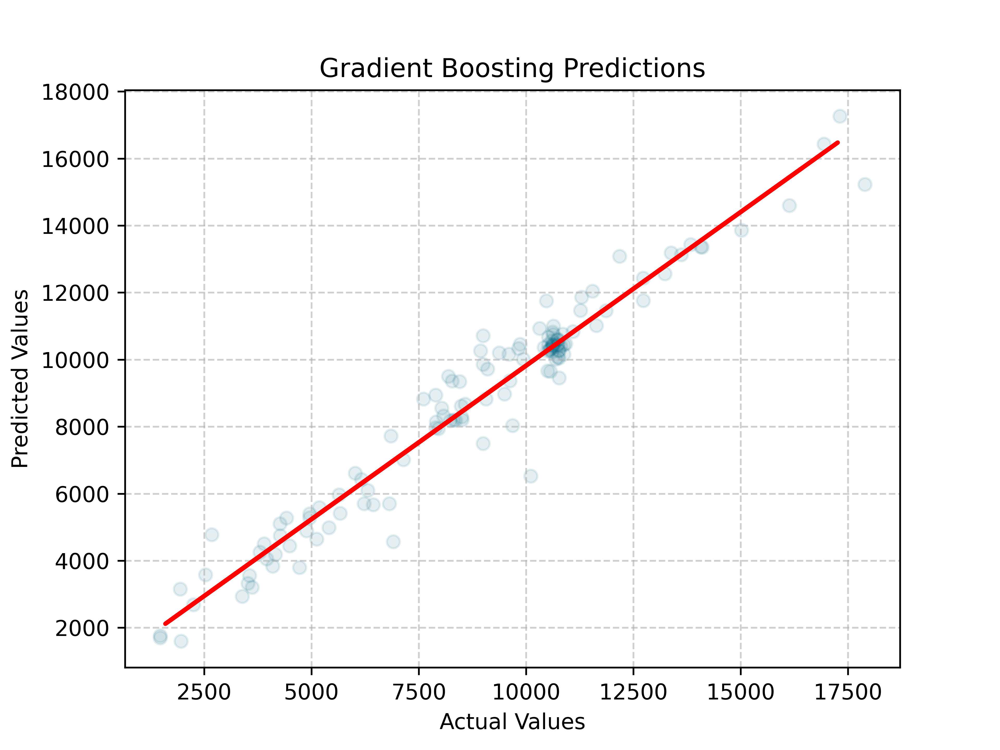
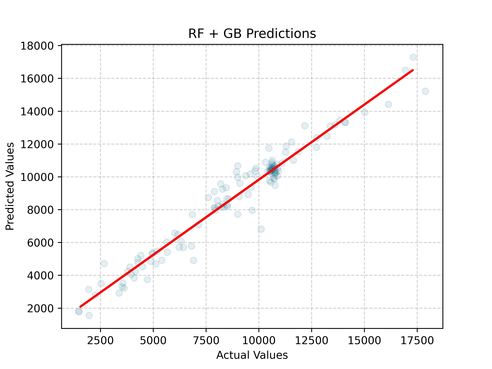

## TEC: SR Calculator
Aims to determine a player's estimated Skill Rating (SR) in Tetris Effect: Connected based on Attack Per Minute (APM) and Drops Per Minute (DPM). 

How is data collected?

- Match ends in Phase 3 (high rank)
- Match lasts 3 minutes or more (low rank)
- Less than 2000 SR difference between players
- Neither player has green SR

*Note: Data contained in old_data or similar files might not reflect this.*

Where did this data come from?

Streams on twitch.tv, personal matches and friend matches.

*Note: Data contains no usernames nor sources for anonymity. Even I cannot trace it back.*

Why only 4 features?

Tetris Effect: Connected only directly provides 5 metrics:
- Drops Per Minute (DPM); aka `Speed`
    - Also known as Pieces Per Second (PPS) in some games. Multiply this value by 60 to get DPM.
- Attack Per Minute (APM); aka `Attack`
- Zone Attack Per Minute (ZAPM)
    - Zone attack is a weird metric, as much as I'd like to include it, zoning in Phase 1 (the longest and easiest phase to zone in) and then never again can result in an over-inflated value.
    - Furthermore, since `ZAPM` only divides by time spent in zone, a zone can last a few frames, therefore, it is easy have a `ZAPM` in the thousands.
            

            
Image from the Enhance Discord 

            
            

    - These situations are rare, but it's not uncommon to see lots of ZAPM fluctuation.
- Score
    - Score determines the phase of the game. Lower rating players typically don't reach Phase 3 (60k points), and higher rating players reach it in a minute or two.
    - The reason this is not relevant is because efficiency is already dictated by APM/DPM.
- Time
    - No matter what rating you are, if you are against an evenly matched opponent, rounds can last 10 minutes or more. (The longest round I've had is 20 minutes, the shortest a few seconds)

If we expand these, we get:
- Attack Efficiency `(APP = APM/DPM)`
- Score Efficiency `(Score/(DPM*Time))`
    - Very similar to attack efficiency, therefore is not included in the dataset.
    - Zone provides a higher boost in `Attack` than in `Score`, in a mode about trying to eliminate the other player, `Attack` is really what matters the most.

Therefore, from there, I decided the most important features are:
- Speed (DPM)
- Attack (APM)
- Efficiency
    - Initially, I didn't include this one, but decided to after realizing it was overawarding speed.
    - Despite only influencing the model's outcome by 10% *(according to the random forest)*, 10% can make the difference of a few hundred SR. 
- Date
    - I included this for SR creep, but the game has died down, so it's not as useful.

<!--START_SECTION:metrics-->
## Models:

*Last Update: 2025-12-24 17:37:17*
### Linear (Auto):
 - Root Mean Squared Error: 968.57
 - Mean Absolute Percentage Error: 11.55%
 - R-Squared: 0.9194

### Random Forest:
 - Root Mean Squared Error: 799.71
 - Mean Absolute Percentage Error: 8.76%
 - R-Squared: 0.9450

### Gradient Boosting:
 - Root Mean Squared Error: 784.52
 - Mean Absolute Percentage Error: 8.35%
 - R-Squared: 0.9471

### Random Forest + Gradient Boosting (Auto):
 - Root Mean Squared Error: 786.69
 - Mean Absolute Percentage Error: 8.53%
 - R-Squared: 0.9468

### All:
 - Root Mean Squared Error: 803.45
 - Mean Absolute Percentage Error: 9.11%
 - R-Squared: 0.9445

## Feature Importance:
| Feature   | Gini Importance   |
|:----------|:------------------|
| APM       | 45.66%            |
| DPM       | 37.62%            |
| APP       | 12.27%            |
| Date      | 4.46%             |
## Ranges:
 - DPM: 27.2 - 162.3
 - APM: 2.1 - 142.4
 - SR: 1431 - 17894

## Data:
 - Training: 1033 Points
 - Testing: 115 Points
 - All: 1148 Points

<!--END_SECTION:metrics-->

| Speed (DPM) vs. SR | Attack (APM) vs. SR | Efficiency (APP) vs. SR |
| :---: | :---: | :---: |
|  |  |  |

| Linear Predicted vs Real | Random Forest Predicted vs Real | Gradient Boosting Predicted vs Real | RF + GF Predicted vs Real | All Models' Predicted vs Real |
| :---: | :---: | :---: | :---: | :---: |
|  |  |  |  |  | 
