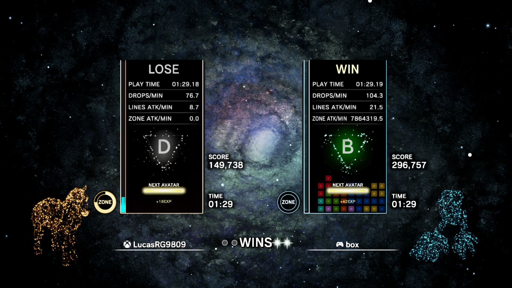
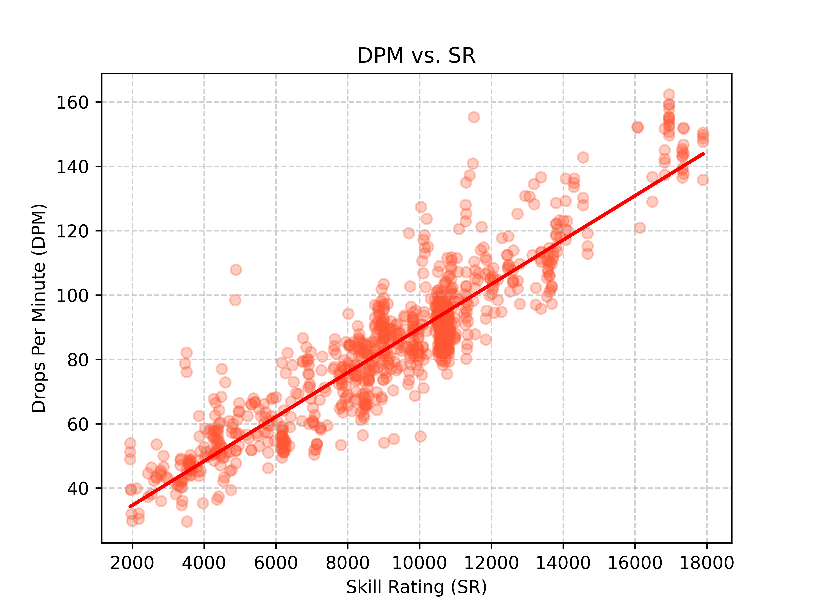
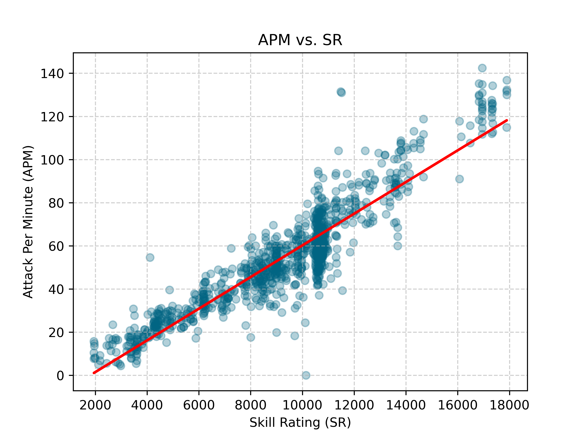
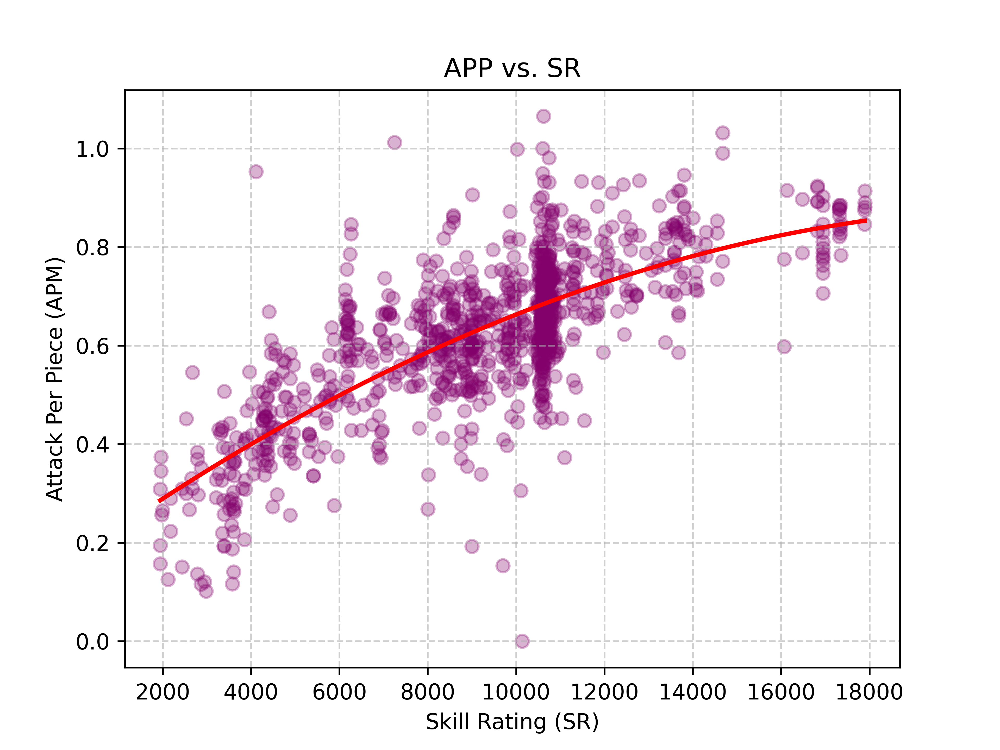

## TEC: SR Calculator
Aims to determine a player's estimated Skill Rating (SR) in Tetris Effect: Connected based on Attack Per Minute (APM) and Drops Per Minute (DPM). 

<details>
<summary>How is data collected?</summary>

- Match ends in Phase 3 (high rank)
- Match lasts 3 minutes or more (low rank)
- Less than 2000 SR difference between players
- Neither player has green SR

*Note: Data contained in old_data or similar files might not reflect this.*
</details>

<details>
<summary>Where did this data come from?</summary>

> Streams on twitch.tv, personal matches and friend matches.

*Note: Data contains no usernames nor sources for anonymity.*
</details>

<details>
<summary>Why only 2 (technically 3) features?</summary>

Tetris Effect: Connected only directly provides 5 metrics:
- Drops Per Minute (DPM); aka `Speed`
- Attack Per Minute (APM); aka `Attack`
- Zone Attack Per Minute (ZAPM)
    - Zone attack is a weird metric, as much as I'd like to include it, zoning in Phase 1 (the longest and easiest phase to zone in) and then never again can result in an over-inflated value.
    - Furthermore, since `ZAPM` only divides by time spent in zone, a zone can last a few frames, and as long as you scored just one line, you will have a `ZAPM` in the hundreds.
        - See below for some images:
            <details>
            <summary>Image from the Enhance Discord </summary>

            
            </details>
    - These situations are rare, but it's not uncommon to see lots of ZAPM fluctuation.
- Score
    - Score determines the phase of the game. Lower rating players typically don't reach Phase 3 (60k points), and higher rating players reach it in a minute or two.
    - The reason this is not relevant is because efficiency is already dictated by APM/DPM.
- Time
    - No matter what rating you are, if you are against an evenly matched opponent, rounds can last 10 minutes or more. (The longest round I've had is 20 minutes, the shortest a few seconds)

If we expand these, we get:
- Attack Efficiency `(APP = APM/DPM)`
    - This was not included because it is directly related to the two main features.
- Score Efficiency `(Score/(DPM*Time))`
    - Very similar to attack efficiency, therefore is not included in the dataset.
    - Zone provides a higher boost in `Attack` than in `Score`, in a mode about trying to topout the other player, `Attack` is really what matters the most.


</details>


<!--START_SECTION:metrics-->
## Statistics:
 - Timestamp: **2025-10-23 23:47:20**

Random Forest Model:
 - MSE: **493360.11**
 - R2: **0.9458**

Linear Model:
 - MSE: **782030.87**
 - R2: **0.9141**

## Data:
```text
<1K SR				0 points		░░░░░░░░░░░░░░░░░░░░░░░░░░░░░░░░░░░░░░░░░░░░░░░░░░
1 - 2K SR			7 points		░░░░░░░░░░░░░░░░░░░░░░░░░░░░░░░░░░░░░░░░░░░░░░░░░░
2 - 3K SR			19 points		█░░░░░░░░░░░░░░░░░░░░░░░░░░░░░░░░░░░░░░░░░░░░░░░░░
3 - 4K SR			48 points		██░░░░░░░░░░░░░░░░░░░░░░░░░░░░░░░░░░░░░░░░░░░░░░░░
4 - 5K SR			70 points		████░░░░░░░░░░░░░░░░░░░░░░░░░░░░░░░░░░░░░░░░░░░░░░
5 - 6K SR			31 points		██░░░░░░░░░░░░░░░░░░░░░░░░░░░░░░░░░░░░░░░░░░░░░░░░
6 - 7K SR			59 points		███░░░░░░░░░░░░░░░░░░░░░░░░░░░░░░░░░░░░░░░░░░░░░░░
7 - 8K SR			49 points		██░░░░░░░░░░░░░░░░░░░░░░░░░░░░░░░░░░░░░░░░░░░░░░░░
8 - 9K SR			125 points		██████░░░░░░░░░░░░░░░░░░░░░░░░░░░░░░░░░░░░░░░░░░░░
9 - 10K SR			116 points		██████░░░░░░░░░░░░░░░░░░░░░░░░░░░░░░░░░░░░░░░░░░░░
10 - 11K SR			343 points		████████████████░░░░░░░░░░░░░░░░░░░░░░░░░░░░░░░░░░
11 - 12K SR			50 points		██░░░░░░░░░░░░░░░░░░░░░░░░░░░░░░░░░░░░░░░░░░░░░░░░
12 - 13K SR			31 points		██░░░░░░░░░░░░░░░░░░░░░░░░░░░░░░░░░░░░░░░░░░░░░░░░
13 - 14K SR			43 points		██░░░░░░░░░░░░░░░░░░░░░░░░░░░░░░░░░░░░░░░░░░░░░░░░
14 - 15K SR			16 points		█░░░░░░░░░░░░░░░░░░░░░░░░░░░░░░░░░░░░░░░░░░░░░░░░░
15 - 16K SR			0 points		░░░░░░░░░░░░░░░░░░░░░░░░░░░░░░░░░░░░░░░░░░░░░░░░░░
16 - 17K SR			22 points		█░░░░░░░░░░░░░░░░░░░░░░░░░░░░░░░░░░░░░░░░░░░░░░░░░
17K+ SR				17 points		█░░░░░░░░░░░░░░░░░░░░░░░░░░░░░░░░░░░░░░░░░░░░░░░░░

Training Data:		941 points		█████████████████████████████████████████████░░░░░
Testing Data:		105 points		█████░░░░░░░░░░░░░░░░░░░░░░░░░░░░░░░░░░░░░░░░░░░░░
All Data:			1046 points		██████████████████████████████████████████████████
```
<!--END_SECTION:metrics-->


| Speed (DPM) vs. SR | Attack (APM) vs. SR | Efficiency (APP) vs. SR |
| :---: | :---: | :---: |
|  |  |  |